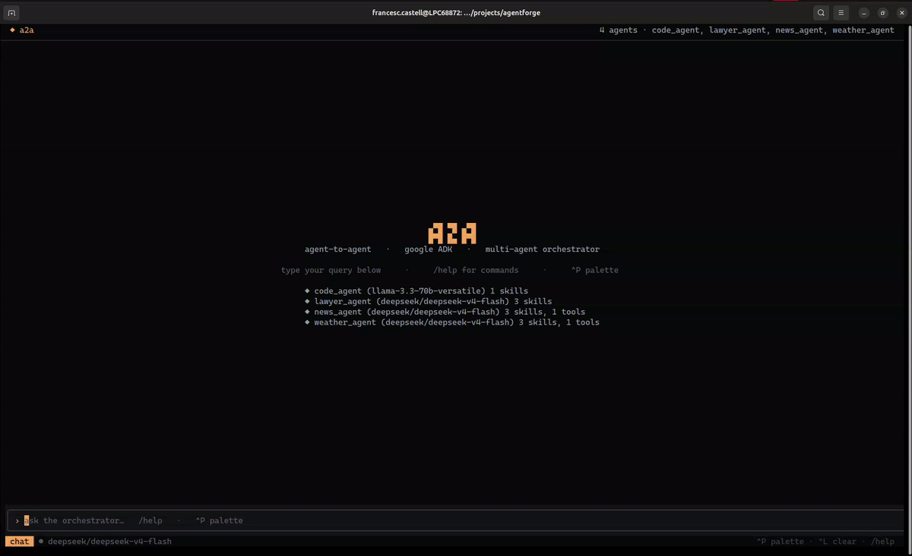
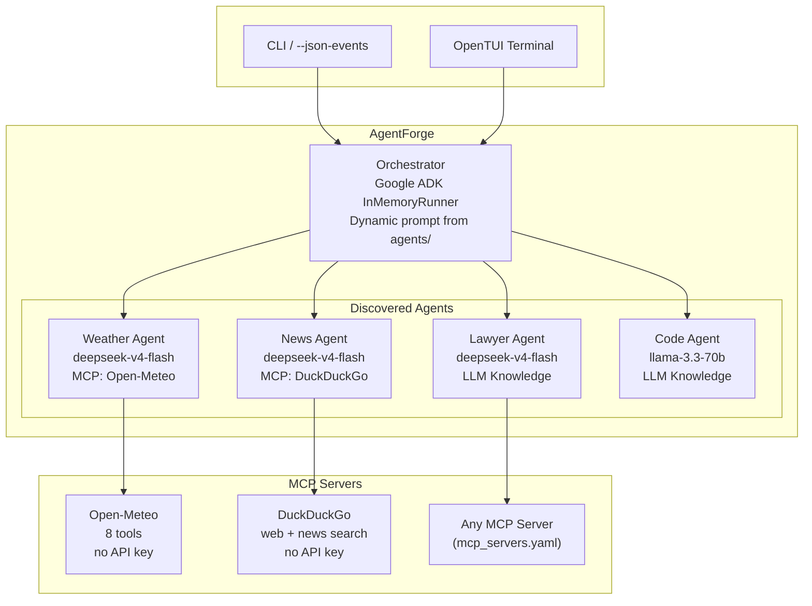

<div align="center">

# AgentForge

[](https://github.com/google/adk-python)
[](https://python.org)
[](https://bun.sh)
[](#providers)
[](#license)

[Overview](#overview) • [Architecture](#architecture) • [Adding an Agent](#adding-an-agent) • [Providers](#providers) • [MCP Tools](#mcp-tools) • [TUI](#terminal-ui) • [Project Structure](#project-structure) • [Quick Start](#quick-start)

</div>

---

## Overview

**AgentForge** is a YAML-defined, multi-agent orchestrator built on [Google ADK](https://github.com/google/adk-python). Instead of writing Python to register sub-agents, you drop a directory with a few YAML files and the orchestrator discovers it, describes it to the LLM, and routes queries automatically.

It ships with four example agents (weather, news, legal, code) and supports **11 LLM providers** with per-agent configuration, **real MCP tools** (Open-Meteo, DuckDuckGo — zero API keys required), a **terminal UI** with delegation visualization, and automatic retry on upstream failures.

> [!NOTE]
> The orchestrator's system prompt is **dynamically generated** at startup by scanning `agents/`. Each agent's skills (with tags and example queries) and MCP tools are injected into the prompt so the LLM knows exactly when and where to delegate. No hardcoded routing.

<div align="center">



</div>

---

## Architecture



The orchestrator uses **Google ADK's native delegation pattern**: a root agent receives all queries, analyzes intent, and delegates to the appropriate sub-agent. Sub-agents can use MCP tools, LLM internal knowledge, or both.

---

## Adding an Agent

Create a directory under `agents/` with three files:

```
agents/my_agent/
├── config.yaml
├── prompt.yaml
└── skills/
    └── myskill.yaml
```

**config.yaml** — model, provider, and MCP bindings:
```yaml
name: "My Agent"
provider:
  name: openrouter
  model: "deepseek/deepseek-v4-flash"
  api_key_env: "OPENROUTER_API_KEY"
mcps:
  - weather-mcp
skills_paths:
  - "~/.config/opencode/skills/recipes"
```

**prompt.yaml** — the agent's system prompt:
```yaml
system_prompt: |
  You are an expert chef. Propose detailed recipes and culinary advice.
  If the question is not about cooking, respond exactly:
  "ERROR: I cannot answer that. I only know about recipes."
```

**skills/myskill.yaml** — declarative skill definitions for the dynamic orchestrator prompt:
```yaml
id: recipe_search
name: Recipe Search
description: Search recipes by ingredients, cuisine, or occasion
tags:
  - recipes
  - cooking
examples:
  - "Give me a recipe with chicken and rice"
  - "What can I cook with avocado and quinoa"
```

> [!TIP]
> Disable an agent by renaming its directory with a `.disabled` suffix, or set `enabled: false` in `config.yaml`.

---

## Providers

Every agent can use a different provider. Set `provider.name` and `provider.model` in the agent's `config.yaml`:

| Provider | `name` | Example model | Env var |
| :--- | :--- | :--- | :--- |
| **OpenRouter** | `openrouter` | `deepseek/deepseek-v4-flash` | `OPENROUTER_API_KEY` |
| **OpenAI** | `openai` | `gpt-4o-mini` | `OPENAI_API_KEY` |
| **Anthropic** | `anthropic` | `claude-3-5-sonnet-20241022` | `ANTHROPIC_API_KEY` |
| **Google Gemini** | `google` | `gemini-2.5-flash` | `GEMINI_API_KEY` |
| **xAI (Grok)** | `xai` | `grok-beta` | `XAI_API_KEY` |
| **DeepSeek** | `deepseek` | `deepseek-chat` | `DEEPSEEK_API_KEY` |
| **Mistral AI** | `mistral` | `mistral-large-latest` | `MISTRAL_API_KEY` |
| **Groq** | `groq` | `llama-3.1-70b-versatile` | `GROQ_API_KEY` |
| **Cerebras** | `cerebras` | `llama3.1-8b` | `CEREBRAS_API_KEY` |
| **OpenCode Zen** | `opencode` | `deepseek-v4-flash-free` | `OPENCODE_ZEN_API_KEY` |
| **Local** | `local` | `llama3.2` | none (uses `base_url`) |

Local models (Ollama, LM Studio, vLLM):
```yaml
provider:
  name: local
  base_url: "http://localhost:11434/v1"
  model: "llama3.2"
```

> [!NOTE]
> Provider environments are isolated per-agent via `.env` files. The system loads `.env` from the project root first, then overrides with per-agent `.env` if present.

> [!WARNING]
> **OpenAI-compatible providers** (OpenRouter, DeepSeek, xAI, local Ollama) share `OPENAI_API_KEY` and `OPENAI_API_BASE` env vars. Only one can be active per process. AgentForge detects this at startup and logs a warning if agents use conflicting providers. For mixed-provider setups, combine providers with distinct env vars (e.g. OpenRouter + Anthropic + Google) — these are fully isolated.

---

## MCP Tools

Define MCP servers once in `mcp_servers.yaml`:

```yaml
weather-mcp:
  type: local
  command: python3
  args: ["-m", "mcp_weather_server"]

openrouter-mcp:
  type: remote
  url: https://mcp.openrouter.ai/mcp
```

Reference by name in any agent's `config.yaml`:

```yaml
mcps:
  - weather-mcp
```

### Bundled (key-less) tools

| MCP Server | Tools | API Key |
| :--- | :--- | :--- |
| **Open-Meteo** (`mcp_weather_server`) | 8 tools: current weather, forecast, air quality, timezone, datetime | None |
| **DuckDuckGo** (`duckduckgo-mcp`) | web search, news search | None |

---

## Terminal UI

The TUI (TypeScript + OpenTUI, `bun`) provides a visual interface for the orchestrator with tool tree rendering and delegation visualization.

| Key | Action |
| :--- | :--- |
| `Ctrl+P` | Command palette |
| `Ctrl+L` | Clear conversation |
| `Ctrl+Y` | Copy selected text |
| `Esc` | Quit |

| Slash command | Action |
| :--- | :--- |
| `/agents` | List connected agents with skills and tools |
| `/help` | Show available commands |
| `/clear` | Clear conversation |
| `/exit` | Quit |

---

## Project Structure

```
.
├── orchestrator.py            # Thin entry point (delegates to core/)
├── pyproject.toml             # Python packaging (pip install agentforge)
├── mcp_servers.yaml           # Central MCP server registry
├── .env.example               # All provider API key templates
├── requirements.txt           # Python dependencies
│
├── core/                      # Modular core package
│   ├── __init__.py            # Public API exports
│   ├── providers.py           # 11 LLM providers + API key resolution
│   ├── mcp_loader.py          # MCP server registry & toolset builder
│   ├── skills.py              # Declarative skill loading & formatting
│   ├── prompt_builder.py      # Dynamic orchestrator prompt generation
│   ├── agent_loader.py        # Agent discovery & YAML config loading
│   ├── runner.py              # CLI + JSON-events runner with retry
│   └── errors.py              # Error classification & retry logic
│
├── tests/                     # pytest test suite
│   ├── conftest.py
│   ├── test_providers.py
│   ├── test_skills.py
│   ├── test_prompt_builder.py
│   ├── test_agent_loader.py
│   ├── test_mcp_loader.py
│   └── test_errors.py
│
├── agents/
│   ├── orchestrator/           # Root orchestrator (routing agent)
│   │   ├── config.yaml
│   │   ├── prompt.yaml
│   │   └── skills/router.yaml
│   ├── weather_agent/         # Weather (MCP: Open-Meteo)
│   │   ├── config.yaml
│   │   ├── prompt.yaml
│   │   ├── mcps/weather.yaml
│   │   └── skills/weather.yaml
│   ├── news_agent/       # News (MCP: DuckDuckGo)
│   │   ├── config.yaml
│   │   ├── prompt.yaml
│   │   ├── mcps/search.yaml
│   │   └── skills/news.yaml
│   ├── lawyer_agent/        # Legal (LLM knowledge, no MCP)
│   │   ├── config.yaml
│   │   ├── prompt.yaml
│   │   ├── mcps/.gitkeep
│   │   └── skills/legal.yaml
│   └── code_agent/          # Code (Groq, LLM knowledge)
│       ├── config.yaml
│       ├── prompt.yaml
│       └── skills/code.yaml
│
└── tui/
    ├── index.ts               # OpenTUI terminal interface
    ├── package.json
    └── tsconfig.json
```

---

## Quick Start

### Prerequisites

- Python 3.10+
- [Bun](https://bun.sh) (for the TUI)
- An API key for any supported provider

### 1. Install dependencies

```bash
pip install -e ".[dev,weather]"
```

This installs AgentForge in editable mode with dev tools (pytest) and the
weather MCP server. For a minimal install:

```bash
pip install -r requirements.txt
pip install mcp_weather_server
```

### 2. Configure

```bash
cp .env.example .env
# Edit .env — set your API key (e.g., OPENROUTER_API_KEY)
```

### 3. Run

**CLI mode:**
```bash
python orchestrator.py
# or, after pip install:
agentforge
```

**JSON events (for programmatic use):**
```bash
python orchestrator.py --json-events
```

**Terminal UI:**
```bash
cd tui && bun install && cd .. && bun run tui/index.ts
```

---

<div align="center">

Built with [Google ADK](https://github.com/google/adk-python)

</div>
